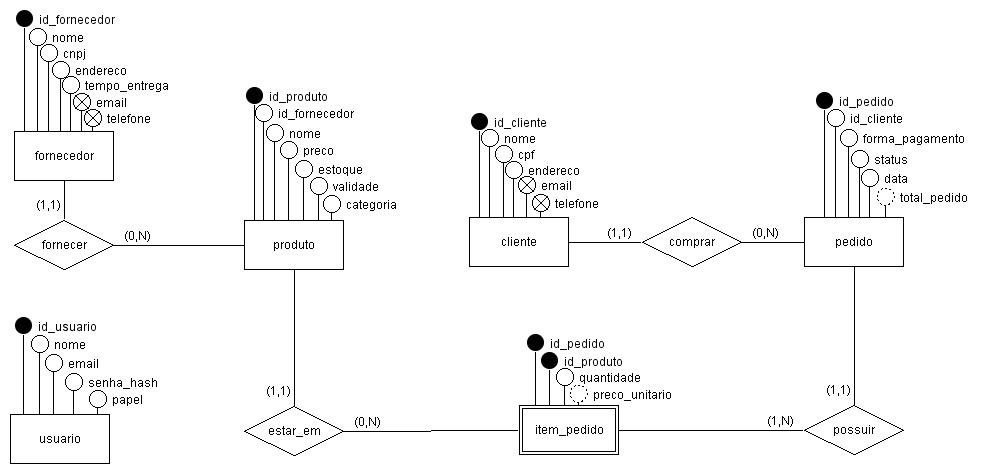

# Relatório – Sistema de Pedidos para Loja de Bebidas

## 1. Introdução
A modernização dos processos comerciais é essencial para empresas que buscam maior eficiência e competitividade. No caso da loja de bebidas, o controle manual de pedidos e vendas tem gerado problemas como erros de registro, falta de organização e dificuldade em acompanhar clientes inadimplentes.

O sistema proposto tem como objetivo automatizar o gerenciamento de pedidos, cadastro de clientes e produtos, controle de estoque e geração de relatórios gerenciais. Dessa forma, busca-se reduzir falhas operacionais, otimizar o tempo dos funcionários e melhorar o atendimento ao cliente.

## 2. Justificativa 

O desenvolvimento de um sistema de pedidos para uma loja de bebidas se justifica pela necessidade de modernização dos processos comerciais, especialmente em pequenos estabelecimentos que ainda utilizam métodos manuais para o controle de vendas. 

Atualmente, o uso de cadernos ou anotações informais para registrar pedidos pode ocasionar diversos problemas, como erros de registro, perda de informações, dificuldade no controle financeiro e falta de organização dos dados. Essas falhas impactam diretamente a gestão do negócio, podendo gerar prejuízos e comprometer a qualidade do atendimento ao cliente. 

Diante desse cenário, a implementação de um software torna-se essencial para garantir maior controle, precisão e agilidade nas operações. A automatização dos processos permite o registro seguro das informações, a geração de relatórios confiáveis e o acompanhamento em tempo real das vendas e do estoque. 

Além disso, o sistema contribui para a melhoria na tomada de decisões, uma vez que fornece dados organizados e acessíveis, auxiliando o gestor a identificar padrões de consumo, clientes em débito e produtos mais vendidos. 

Portanto, este projeto tem como finalidade oferecer uma solução prática, eficiente e acessível, capaz de otimizar a gestão comercial de uma loja, reduzir erros operacionais e aumentar a produtividade dos funcionários. 

## 3. Problema
Atualmente, o controle de vendas é feito manualmente em cadernos, o que ocasiona:

- Erros frequentes em pedidos e cálculos de valores  
- Falta de clareza na entrada e saída de dinheiro  
- Dificuldade em identificar clientes inadimplentes  
- Ausência de relatórios para apoiar decisões de compra e reposição de estoque  
- Falta de histórico consolidado de clientes e produtos  

## 4. Objetivo
O sistema tem como proposta:

- Automatizar o processo de registro de pedidos e vendas  
- Reduzir erros e inconsistências nos registros  
- Facilitar a gestão de clientes, produtos e estoque  
- Melhorar a eficiência operacional e o atendimento ao cliente  
- Fornecer relatórios gerenciais para apoiar a tomada de decisão  
- Garantir segurança e integridade dos dados

## 5. Definição de Requisitos do Usuário 

Necessita-se de um sistema de controle comercial, onde constam clientes, produtos, fornecedores e pedidos. 

### 5.1 Necessidades do usuário 

O sistema deverá atender às necessidades operacionais de uma loja de bebidas, permitindo o controle eficiente das vendas e do relacionamento com clientes. Para isso, o sistema deverá possibilitar: 

  Cadastro de clientes, incluindo nome, CPF, telefone, endereço e e-mail; 

  Cadastro de produtos, contendo nome, quantidade em estoque, validade e preço; 

   Registro de pedidos vinculados a um cliente; 

  Controle automático de estoque, com atualização após cada venda; 

   Consulta de clientes em débito; 

  Visualização de informações sobre produtos disponíveis; 

   Geração de relatórios de vendas e desempenho do negócio; 

   Registro da forma de pagamento (dinheiro, cartão, pix, etc.); 

### 5.2 Problemas atuais 

Atualmente, o controle de vendas e pedidos é realizado de forma manual, utilizando cadernos ou anotações informais. Esse método apresenta diversas limitações, tais como: 

   Falta de organização das informações; 

   Alta probabilidade de erros no registro de pedidos; 

   Dificuldade no controle de entrada e saída de dinheiro; 

   Ausência de controle eficiente de estoque; 

  Risco de perda de dados importantes; 

   Dificuldade na identificação de clientes inadimplentes; 

Esses problemas impactam diretamente a eficiência do negócio e a qualidade do atendimento ao cliente. 

### 5.3 Objetivos do sistema 

O sistema tem como principal objetivo automatizar o processo de gerenciamento de pedidos em uma loja de bebidas, proporcionando maior controle, organização e confiabilidade das informações. Entre os principais objetivos, destacam-se: 

   Reduzir erros operacionais; 

   Melhorar a organização dos dados; 

   Facilitar o controle financeiro; 

   Otimizar o gerenciamento de estoque; 

   Agilizar o atendimento ao cliente; 

   Auxiliar na tomada de decisões por meio de relatórios; 

  Garantir maior segurança e integridade das informações; 

Dessa forma, o sistema contribuirá para tornar o processo de vendas mais eficiente, moderno e confiável.

## 6. Escopo

### Cadastro de Clientes
- Nome completo  
- CPF  
- Celular  
- Endereço  
- Email  
- Histórico de compras  

### Cadastro de Produtos
- Nome  
- Quantidade em estoque  
- Data de validade  
- Valor unitário  
- Categoria (ex.: cerveja, refrigerante, destilado)  
- Fornecedor  

### Registro de Pedidos
- Cliente vinculado (já cadastrado)  
- Produtos selecionados e quantidade  
- Forma de pagamento (PIX, cartão, dinheiro)  
- Valor total do pedido  
- Status do pagamento (pago, em débito)  
- Data e hora do pedido  

### Relatórios
- Clientes inadimplentes e valores em aberto  
- Vendas por período (diário, semanal, mensal)  
- Produtos mais vendidos  
- Estoque disponível e alertas de baixa quantidade  
- Comparativo de vendas por categoria de produto  
- Histórico de compras por cliente  

## 7. Especificação de Requisitos

Especificação de requisitos do sistema 

### 7.1 Requisitos Funcionais 

   RF01 – O sistema deve permitir o cadastro de clientes; 

   RF02 – O sistema deve permitir o cadastro de produtos; 

   RF03 – O sistema deve permitir o registro de pedidos; 

  RF04 – O sistema deve permitir a edição de dados de clientes e produtos; 

   RF05 – O sistema deve permitir a exclusão de clientes e produtos; 

   RF06 – O sistema deve permitir a consulta de clientes cadastrados; 

   RF07 – O sistema deve permitir a consulta de produtos disponíveis; 

   RF08 – O sistema deve gerar relatórios de vendas; 

   RF09 – O sistema deve controlar automaticamente o estoque dos produtos; 

  RF10 – O sistema deve identificar clientes em débito; 

   RF11 – O sistema deve permitir o registro da forma de pagamento; 

   RF12 – O sistema deve permitir o cancelamento de pedidos; 

   RF13 – O sistema deve permitir o login de usuários autorizados;  

### 7.2 Regras de Negócio 

   RN01 – O sistema não deve permitir a venda de produtos sem estoque disponível; 

   RN02 – O valor total do pedido deve ser calculado automaticamente com base na quantidade e no preço do produto; 

   RN03 – Todo pedido deve estar vinculado a um cliente cadastrado; 

   RN04 – O sistema deve atualizar o estoque automaticamente após cada venda; 

   RN05 – O sistema deve registrar o histórico de pedidos realizados; 

   RN06 – Clientes com débitos devem ser identificados no sistema; 

   RN07 – O sistema deve registrar a forma de pagamento de cada pedido;  

### 7.3 Requisitos Não Funcionais 

   RNF01 – O sistema deve responder às ações do usuário em até 5 segundos;  

#### Usabilidade 

   RNF02 – O sistema deve possuir interface simples e intuitiva; 

  RNF03 – O usuário deve ser capaz de utilizar o sistema após treinamento básico;  

#### Segurança

   RNF05 – O sistema deve garantir que apenas usuários autorizados tenham acesso às informações;  

#### Confiabilidade 

  RNF06 – O sistema deve garantir a integridade dos dados armazenados; 

   RNF07 – O sistema deve permitir recuperação de dados em caso de falhas;  

#### Disponibilidade 

   RNF08 – O sistema deve estar disponível durante o horário de funcionamento da loja; 

## 8. Arquitetura Proposta
- **Frontend**: Interface web responsiva, acessível em computadores e dispositivos móveis  
- **Backend**: API REST desenvolvida em linguagem moderna (ex.: Java, Python ou Node.js)  
- **Banco de Dados**: Relacional (ex.: MySQL ou PostgreSQL) para garantir integridade e consistência  
- **Segurança**: Autenticação JWT, criptografia de senhas e controle de acesso por perfil  
- **Infraestrutura**: Hospedagem em servidor local ou nuvem (AWS, Azure, GCP)  

## 9. Benefícios Esperados
- Redução de erros em pedidos e cálculos financeiros  
- Maior controle sobre clientes inadimplentes  
- Organização eficiente do estoque e reposição preventiva  
- Agilidade no atendimento ao cliente  
- Apoio à gestão com relatórios claros e objetivos  
- Segurança e confiabilidade dos dados  
- Escalabilidade para crescimento da loja

## 10. Modelagem de Dados (DER) 

 

A modelagem de dados do sistema foi desenvolvida com o objetivo de representar de forma estruturada as informações necessárias para o funcionamento do sistema de pedidos da loja de bebidas. 

O modelo Entidade-Relacionamento (DER) define as principais entidades do sistema, seus atributos e os relacionamentos entre elas, garantindo organização, integridade e eficiência no armazenamento dos dados. 

As principais entidades identificadas foram: 

- **Cliente**: armazena os dados dos clientes cadastrados no sistema. 
- **Fornecedor**: armazena os dados dos fornecedores que abastecem os produtos. 
- **Produto**: armazena as informações dos produtos disponíveis para venda, vinculados a um fornecedor. 
- **Pedido**: representa as vendas realizadas, associando clientes aos produtos adquiridos. 
- **ItemPedido**: detalha os produtos contidos em cada pedido (entidade fraca que resolve o N:N entre `Pedido` e `Produto`). 
- **Usuário**: representa os funcionários autorizados a operar o sistema (atende ao RF13 e RNF04). 

A seguir, são descritas as entidades e seus principais atributos: 

### Cliente 

- `id_cliente` (chave primária) 
- `nome` 
- `cpf` (único) 
- `endereço` 
- `email` (multivalorado) 
- `telefone` (multivalorado) 

### Fornecedor 

- `id_fornecedor` (chave primária) 
- `nome` 
- `cnpj` (único) 
- `endereço` 
- `tempo_entrega` 
- `email` (multivalorado) 
- `telefone` (multivalorado) 

### Produto 

- `id_produto` (chave primária) 
- `nome` 
- `estoque` 
- `validade` 
- `preço` 
- `id_fornecedor` (chave estrangeira → Fornecedor) 
- `categoria` 

### Pedido 

- `id_pedido` (chave primária) 
- `id_cliente` (chave estrangeira → Cliente) 
- `data_pedido` 
- `valor_total` (derivado) 
- `forma_pagamento` (DINHEIRO, CARTAO, PIX, FIADO) 
- `status` (PENDENTE, PAGO, CANCELADO) 

### ItemPedido 

- `id_pedido` (chave estrangeira → Pedido, parte da PK composta) 
- `id_produto` (chave estrangeira → Produto, parte da PK composta) 
- `quantidade` 
- `preço_unitário` (congelado no momento da venda)  

### Usuário 

- `id_usuario` (chave primária) 
- `nome` 
- `email` (único) 
- `senha_hash` 
- `papel` (FUNCIONARIO, ADMIN) 

### Relacionamentos 

- **Cliente (1,1) — tem — (0,N) Pedido**: um cliente pode realizar vários pedidos; cada pedido pertence a um único cliente. 
- **Pedido (1,1) — contém — (1,N) ItemPedido**: cada pedido possui pelo menos um item. 
- **Produto (1,1) — está em — (0,N) ItemPedido**: um produto pode aparecer em vários pedidos via `ItemPedido`. 
- **Fornecedor (1,1) — fornece — (1,N) Produto**: um fornecedor abastece vários produtos; cada produto possui um fornecedor. 

A entidade `ItemPedido` resolve o relacionamento muitos-para-muitos entre `Pedido` e `Produto`. Esse modelo garante flexibilidade, permitindo que um pedido contenha múltiplos produtos e que os dados sejam armazenados de forma consistente. 

## 11. Considerações Finais
O sistema de pedidos para a loja de bebidas proporcionará maior eficiência operacional, segurança e organização. Além disso, permitirá que gestores tenham informações estratégicas para tomada de decisão, reduzindo falhas e aumentando a competitividade da empresa.