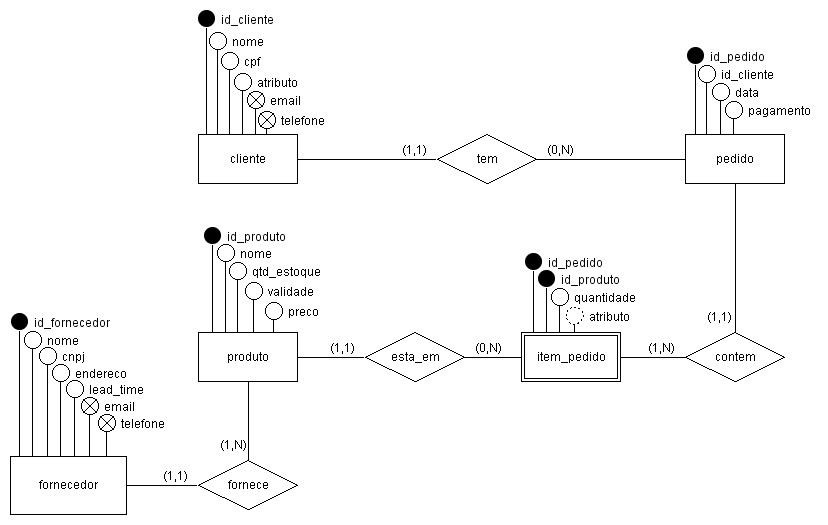
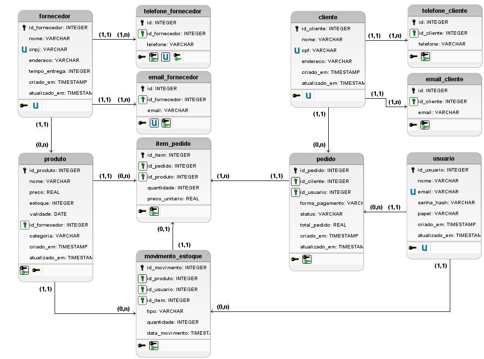

# Projeto

**API REST – Sistema de Pedidos para Loja de Bebidas**  
**FATEC Indaiatuba · Análise e Desenvolvimento de Sistemas · Grupo G · 2026**  
**Repositório:** https://github.com/viniciusroll/apirest-pi

---

## Sumário

1. [Introdução](#1-introdução)
2. [Critérios de Aceite e Qualidade](#2-critérios-de-aceite-e-qualidade)
   - 2.1 [Requisitos Funcionais](#21-requisitos-funcionais)
   - 2.2 [Regras de Negócio](#22-regras-de-negócio)
   - 2.3 [Requisitos Não Funcionais](#23-requisitos-não-funcionais)
3. [Modelagem de Dados](#3-modelagem-de-dados)
   - 3.1 [Entidades e Atributos](#31-entidades-e-atributos)
   - 3.2 [Relacionamentos](#32-relacionamentos)
   - 3.3 [DER – Diagrama Entidade-Relacionamento](#33-der--diagrama-entidade-relacionamento)
   - 3.4 [Modelo Lógico](#34-modelo-lógico)
   - 3.5 [Decisões de Projeto do Banco de Dados](#35-decisões-de-projeto-do-banco-de-dados)
4. [Arquitetura e Estrutura](#4-arquitetura-e-estrutura)
   - 4.1 [Arquitetura em Camadas](#41-arquitetura-em-camadas)
   - 4.2 [Estrutura de Diretórios](#42-estrutura-de-diretórios)
   - 4.3 [Fluxo de uma Requisição](#43-fluxo-de-uma-requisição)
5. [Tecnologias Utilizadas](#5-tecnologias-utilizadas)
6. [Estimativa por Pontos de Função](#6-estimativa-por-pontos-de-função)
   - 6.1 [Entradas do Usuário (EE)](#61-entradas-do-usuário-ee--external-inputs)
   - 6.2 [Saídas do Usuário (SE)](#62-saídas-do-usuário-se--external-outputs)
   - 6.3 [Consultas do Usuário (CE)](#63-consultas-do-usuário-ce--external-inquiries)
   - 6.4 [Arquivos Lógicos Internos (ALI)](#64-arquivos-lógicos-internos-ali--internal-logical-files)
   - 6.5 [Interfaces Externas (AIE)](#65-interfaces-externas-aie--external-interface-files)
   - 6.6 [Resumo da Contagem Total](#66-resumo-da-contagem-total)
   - 6.7 [Fatores de Ajuste de Complexidade](#67-fatores-de-ajuste-de-complexidade-fi)
   - 6.8 [Cálculo Final dos Pontos de Função](#68-cálculo-final-dos-pontos-de-função)
7. [Considerações Finais](#7-considerações-finais)

---

## 1 Introdução

O presente documento descreve a fase de **Projeto** do ciclo de vida do software para a API REST desenvolvida no âmbito do Projeto Integrador da FATEC Indaiatuba. Seguindo o **Modelo Cascata**, a fase de Projeto sucede a Análise de Requisitos e precede a Implementação, tendo como finalidade transformar os requisitos levantados em uma especificação técnica detalhada e suficientemente precisa para guiar a construção do sistema.

O sistema tem por finalidade **automatizar a gestão de uma loja de bebidas**, centralizando o controle de clientes, fornecedores, produtos, pedidos e movimentações de estoque em uma plataforma digital integrada. Nesta fase, são definidos os critérios de aceite e qualidade, a modelagem de dados, a arquitetura da solução, as tecnologias adotadas e a estimativa de tamanho funcional por meio de Pontos de Função.

---

## 2 Critérios de Aceite e Qualidade

A aprovação do sistema está condicionada ao atendimento dos critérios listados a seguir, verificáveis ao final da fase de Implementação e Testes.

### 2.1 Requisitos Funcionais

| ID | Descrição | Critério de aceite |
|---|---|---|
| RF01 | O sistema deve permitir o cadastro de clientes | `POST /clientes` retorna HTTP 201 com objeto criado |
| RF02 | O sistema deve permitir o cadastro de produtos | `POST /produtos` retorna HTTP 201 com objeto criado |
| RF03 | O sistema deve permitir o registro de pedidos | `POST /pedidos` retorna HTTP 201, desconta estoque e calcula total automaticamente |
| RF04 | O sistema deve permitir a edição de dados de clientes e produtos | `PUT /clientes/:id` e `PUT /produtos/:id` retornam HTTP 200 com dados atualizados |
| RF05 | O sistema deve permitir a exclusão de clientes e produtos | `DELETE` retorna HTTP 204; pedidos vinculados bloqueiam a exclusão com HTTP 409 |
| RF06 | O sistema deve permitir a consulta de clientes cadastrados | `GET /clientes` e `GET /clientes/:id` retornam HTTP 200 com dados corretos |
| RF07 | O sistema deve permitir a consulta de produtos disponíveis | `GET /produtos` e `GET /produtos/:id` retornam HTTP 200 com dados corretos |
| RF08 | O sistema deve gerar relatórios de vendas | Rotas de relatório retornam dados consolidados por período, produto e cliente |
| RF09 | O sistema deve controlar automaticamente o estoque dos produtos | Após cada venda, o campo `estoque` é decrementado corretamente na tabela `produto` |
| RF10 | O sistema deve identificar clientes em débito | Filtro `status=PENDENTE` e `forma_pagamento=FIADO` retorna somente clientes inadimplentes |
| RF11 | O sistema deve permitir o registro da forma de pagamento | Campo `forma_pagamento` aceita apenas `DINHEIRO`, `CARTAO`, `PIX` ou `FIADO`; demais valores retornam HTTP 400 |
| RF12 | O sistema deve permitir o cancelamento de pedidos | `PUT /pedidos/:id` com `status=CANCELADO` retorna HTTP 200 |
| RF13 | O sistema deve permitir o login de usuários autorizados | `POST /auth/login` com credenciais válidas retorna token JWT; credenciais inválidas retornam HTTP 401 |

### 2.2 Regras de Negócio

| ID | Descrição | Implementação |
|---|---|---|
| RN01 | O sistema não deve permitir a venda de produtos sem estoque disponível | Validação no service de pedido antes da inserção; banco rejeita estoque negativo via `CHECK` |
| RN02 | O valor total do pedido é calculado automaticamente | Service soma `quantidade × preco_unitario` de cada item e atualiza `total_pedido` |
| RN03 | Todo pedido deve estar vinculado a um cliente cadastrado | `id_cliente NOT NULL` com FK para tabela `cliente` |
| RN04 | O estoque é atualizado automaticamente após cada venda | Service decrementa estoque do produto após inserir cada `item_pedido` |
| RN05 | O histórico de pedidos deve ser preservado | Tabela `pedido` mantém todos os registros, inclusive cancelados |
| RN06 | Clientes com débitos devem ser identificados | Combinação `status=PENDENTE` e `forma_pagamento=FIADO` identifica inadimplentes |
| RN07 | A forma de pagamento é obrigatória em todo pedido | `CHECK` constraint no banco e validação Zod no controller |

### 2.3 Requisitos Não Funcionais

| ID | Categoria | Descrição | Critério de verificação |
|---|---|---|---|
| RNF01 | Desempenho | O sistema deve responder às ações do usuário em até 5 segundos | Testes manuais com `curl` e REST Client; tempo de resposta abaixo de 5 s em ambiente local |
| RNF02 | Usabilidade | O sistema deve possuir interface simples e intuitiva | Respostas JSON padronizadas; mensagens de erro descritivas e consistentes |
| RNF03 | Usabilidade | O usuário deve ser capaz de utilizar o sistema após treinamento básico | Documentação de endpoints disponível; estrutura REST sem ambiguidade |
| RNF04 | Segurança | O sistema deve exigir autenticação para acesso às operações | Todas as rotas protegidas retornam HTTP 401 sem token válido |
| RNF05 | Segurança | Apenas usuários autorizados acessam as informações | Papéis `FUNCIONARIO` e `ADMIN` controlam acesso por middleware JWT |
| RNF06 | Confiabilidade | O sistema deve garantir a integridade dos dados armazenados | FK, `CHECK` e `UNIQUE` constraints impedem inserções inválidas no banco |
| RNF07 | Confiabilidade | O sistema deve permitir recuperação de dados em caso de falhas | Arquivo SQLite único permite backup simples; estrutura compatível com PG para produção |
| RNF08 | Disponibilidade | O sistema deve estar disponível durante o horário de funcionamento | Servidor Express inicializado via `npm start` permanece ativo durante uso |

---

## 3 Modelagem de Dados

A modelagem do banco de dados foi conduzida em duas etapas complementares: o **Diagrama Entidade-Relacionamento (DER)** descreve a visão conceitual do domínio, enquanto o **Modelo Lógico** detalha a estrutura final implementada no SQLite, com tabelas, colunas, tipos, restrições e relacionamentos.

### 3.1 Entidades e Atributos

| Entidade | Atributos principais | Observações |
|---|---|---|
| `cliente` | `id_cliente` (PK), `nome`, `cpf` (UNIQUE), `endereco`, `criado_em`, `atualizado_em` | E-mails e telefones em tabelas auxiliares (atributos multivalorados) |
| `fornecedor` | `id_fornecedor` (PK), `nome`, `cnpj` (UNIQUE), `endereco`, `tempo_entrega`, `criado_em` | E-mails e telefones em tabelas auxiliares; `tempo_entrega` em dias |
| `produto` | `id_produto` (PK), `nome`, `preco`, `estoque`, `validade`, `categoria`, `id_fornecedor` (FK) | `preco > 0` e `estoque >= 0` via `CHECK`; vinculado a um fornecedor |
| `pedido` | `id_pedido` (PK), `id_cliente` (FK), `id_usuario` (FK), `forma_pagamento`, `status`, `total` | `forma_pagamento IN (DINHEIRO, CARTAO, PIX, FIADO)`; `status IN (PENDENTE, PAGO, CANCELADO)` |
| `item_pedido` | `id_item` (PK), `id_pedido` (FK), `id_produto` (FK), `quantidade`, `preco_unitario` | `preco_unitario` congelado no momento da venda; resolve N:N entre `pedido` e `produto` |
| `movimento_estoque` | `id_movimento` (PK), `id_produto` (FK), `id_usuario` (FK), `id_item` (FK), `tipo`, `quantidade` | `tipo IN (ENTRADA, SAIDA)`; registra toda movimentação de estoque |
| `usuario` | `id_usuario` (PK), `nome`, `email` (UNIQUE), `senha_hash`, `papel`, `criado_em` | `papel IN (FUNCIONARIO, ADMIN)`; senha armazenada com hash bcrypt |
| `email_cliente` | `id` (PK), `id_cliente` (FK), `email` | `UNIQUE (id_cliente, email)`; `ON DELETE CASCADE` |
| `telefone_cliente` | `id` (PK), `id_cliente` (FK), `telefone` | `UNIQUE (id_cliente, telefone)`; `ON DELETE CASCADE` |
| `email_fornecedor` | `id` (PK), `id_fornecedor` (FK), `email` | `UNIQUE (id_fornecedor, email)`; `ON DELETE CASCADE` |
| `telefone_fornecedor` | `id` (PK), `id_fornecedor` (FK), `telefone` | `UNIQUE (id_fornecedor, telefone)`; `ON DELETE CASCADE` |

### 3.2 Relacionamentos

| Relacionamento | Cardinalidade | Decisão de projeto |
|---|---|---|
| `cliente` realiza `pedido` | (1,1) – (0,N) | Todo pedido é obrigatoriamente vinculado a um cliente; um cliente pode não ter pedidos |
| `pedido` contém `item_pedido` | (1,1) – (1,N) | Um pedido deve ter ao menos um item; `item_pedido` pertence a exatamente um pedido |
| `produto` aparece em `item_pedido` | (1,1) – (0,N) | Um produto pode não estar em nenhum pedido; resolve N:N entre `pedido` e `produto` |
| `fornecedor` fornece `produto` | (1,1) – (0,N) | Cada produto tem um fornecedor; um fornecedor pode ter múltiplos produtos |
| `usuario` registra `pedido` | (1,1) – (0,N) | Cada pedido é registrado por um funcionário autenticado |
| `usuario` controla `movimento_estoque` | (1,1) – (0,N) | Toda movimentação é rastreada ao usuário responsável |
| `produto` gera `movimento_estoque` | (1,1) – (0,N) | Cada movimentação refere-se a um único produto |
| `item_pedido` referencia `movimento_estoque` | (0,1) – (0,N) | Movimentações de venda são opcionalmente vinculadas ao item que as originou |

### 3.3 DER – Diagrama Entidade-Relacionamento



### 3.4 Modelo Lógico



### 3.5 Decisões de Projeto do Banco de Dados

- **Preço congelado em `item_pedido`:** o campo `preco_unitario` registra o valor praticado no momento da venda. Alterações futuras no preço do produto não afetam pedidos já registrados, preservando o histórico financeiro.

- **Atributos multivalorados em tabelas auxiliares:** e-mails e telefones de clientes e fornecedores são armazenados em tabelas separadas (`email_cliente`, `telefone_cliente`, `email_fornecedor`, `telefone_fornecedor`), permitindo múltiplos contatos sem duplicação de registros.

- **Triggers para atualização de `atualizado_em`:** o SQLite não suporta `ON UPDATE CURRENT_TIMESTAMP` nativamente; triggers foram criados para manter o campo sincronizado em qualquer operação de atualização.

- **Índices em chaves estrangeiras e campos de busca frequente:** foram criados índices nos campos `id_cliente`, `id_usuario`, `id_produto`, `id_pedido` e `status` para otimizar as consultas mais comuns do sistema.

- **Identificação de inadimplentes por combinação de campos:** clientes com débitos são identificados pela combinação `status = PENDENTE` e `forma_pagamento = FIADO`, sem necessidade de coluna adicional.

---

## 4 Arquitetura e Estrutura

### 4.1 Arquitetura em Camadas

O sistema adota o padrão de **arquitetura em camadas** (*Layered Architecture*), no qual cada requisição HTTP percorre as camadas sequencialmente, garantindo separação clara de responsabilidades e facilidade de manutenção.

| Camada | Responsabilidade |
|---|---|
| **Routes** | Define os endpoints disponíveis (URLs e métodos HTTP) e os mapeia para os controllers correspondentes |
| **Controllers** | Recebe a requisição HTTP, valida o payload com schemas Zod e aciona o service adequado |
| **Services** | Aplica as regras de negócio (RN01 a RN07), orquestra chamadas a repositórios e trata exceções de domínio |
| **Repositories** | Executa as instruções SQL e devolve objetos tipados, isolando o acesso ao banco de dados |
| **Middlewares** | Centralizam autenticação JWT, validação de entrada e tratamento global de erros |
| **Models** | Descrevem o formato das entidades em TypeScript, garantindo consistência entre camadas |
| **Schemas Zod** | Validam e tipam os dados de entrada antes de chegarem ao controller, com mensagens de erro claras |
| **SQLite** | Banco de dados relacional em arquivo único; sem servidor externo, ideal para o escopo do projeto |

### 4.2 Estrutura de Diretórios

```
.
├── docs/
│   ├── diagramas/          # DER conceitual e modelo lógico do banco de dados
│   └── relatorios/         # Relatórios técnicos do projeto integrador
├── src/
│   ├── config/             # Variáveis de ambiente e configuração da conexão SQLite
│   ├── controllers/        # Camada HTTP: recebe requisições e aciona services
│   ├── database/           # schema.sql (DDL), init.ts e seed.ts (dados de exemplo)
│   ├── errors/             # Classe AppError customizada para tratamento de exceções
│   ├── middleware/         # Middlewares de autenticação JWT, validação Zod e erros globais
│   ├── models/             # Interfaces TypeScript que descrevem as entidades do domínio
│   ├── repositories/       # Acesso ao banco com SQL puro; retorna objetos tipados
│   ├── routes/             # Definição das rotas Express e agregador central (index.ts)
│   ├── schemas/            # Schemas Zod para validação dos dados de entrada
│   ├── services/           # Regras de negócio e orquestração entre repositórios
│   ├── app.ts              # Configuração do Express: middlewares globais, rotas e erros
│   └── server.ts           # Bootstrap do servidor: carrega variáveis de ambiente e inicia HTTP
├── requests.http           # Coleção de requisições para testes com REST Client (VSCode)
└── package.json            # Dependências, scripts e configuração do projeto Node
```

### 4.3 Fluxo de uma Requisição

```
Cliente HTTP
    │
    ▼
Routes          → direciona para o controller
    │
    ▼
Controllers     → valida payload com schema Zod
    │
    ▼
Services        → aplica regras de negócio (RN01–RN07)
    │
    ▼
Repositories    → executa SQL e retorna dados tipados
    │
    ▼
Services        → consolida resultado
    │
    ▼
Controllers     → formata e envia resposta HTTP
    │
    ▼
Cliente HTTP
```

Em caso de erro, o **middleware centralizado** intercepta a exceção e converte:
- `ZodError` → HTTP 400
- `AppError` → código de status correspondente (ex.: HTTP 409 para violações de integridade)
- Erros inesperados → HTTP 500

Todas as respostas de erro incluem mensagem descritiva no corpo.

---

## 5 Tecnologias Utilizadas

| Tecnologia | Camada / Função | Versão / Observação |
|---|---|---|
| **TypeScript** | Linguagem principal | Tipagem estática; previne erros em tempo de desenvolvimento e melhora a experiência com IDEs |
| **Node.js** | Ambiente de execução | Execução de JavaScript/TypeScript no servidor; alta performance para APIs assíncronas |
| **Express** | Framework HTTP | Padrão consolidado no ecossistema Node; criação de rotas e middlewares de forma simples |
| **SQLite** (`sqlite3`) | Banco de dados | Arquivo único sem servidor externo; ideal para o escopo do projeto integrador |
| **Zod** | Validação de entrada | Schema-first; integra nativamente com TypeScript e gera mensagens de erro descritivas |
| **JWT** (`jsonwebtoken`) | Autenticação | Padrão da indústria para autenticação stateless; tokens assinados e verificáveis |
| **bcryptjs** | Hash de senhas | Algoritmo lento por design; resistente a ataques de força bruta |
| **tsx** | Runner de desenvolvimento | Executa TypeScript diretamente com hot reload, sem compilação explícita |
| **GitHub** | Controle de versão | Repositório remoto com branches por feature e Pull Requests revisados antes do merge |
| **Insomnia / Apidog** | Testes e documentação | Ferramentas para testar endpoints e documentar a API durante o desenvolvimento |

---

## 6 Estimativa por Pontos de Função

A técnica de **Pontos de Função** (*Function Point Analysis – FPA*) foi aplicada para estimar o tamanho funcional do sistema de forma independente da tecnologia utilizada. A contagem baseia-se nos parâmetros de medida definidos pelo **IFPUG** (*International Function Point Users Group*).

O resultado final é obtido pela fórmula:

```
FP = Contagem Total × [0,65 + 0,01 × Soma(Fi)]
```

Onde `Contagem Total` é a soma ponderada dos cinco parâmetros de medida e `Soma(Fi)` é a soma dos 14 fatores de ajuste de complexidade, cada um avaliado em escala de 0 a 5.

### 6.1 Entradas do Usuário (EE – External Inputs)

Processos que recebem dados externos (`POST`, `PUT`, `DELETE` com processamento de negócio) e os inserem ou modificam em arquivos lógicos internos.

> Ponderação: Simples = 3 · Médio = 4 · Complexo = 6

| # | Função | Descrição | Complexidade | Pontos |
|---|---|---|---|---|
| 1 | Usuário | Cadastro e manutenção de usuários do sistema, incluindo autenticação e gerenciamento de senhas | Complexo | 6 |
| 2 | Cliente | Cadastro e manutenção de clientes | Simples | 3 |
| 3 | Fornecedor | Cadastro e manutenção de fornecedores | Simples | 3 |
| 4 | Produto | Cadastro e manutenção de produtos | Simples | 3 |
| 5 | Pedido | Registro e gerenciamento de pedidos de venda | Médio | 4 |
| | | | **SUBTOTAL** | **19** |

### 6.2 Saídas do Usuário (SE – External Outputs)

Processos que enviam dados para fora do sistema com algum processamento adicional (cálculos, transformações, consolidações).

> Ponderação: Simples = 4 · Médio = 5 · Complexo = 7

| # | Função | Descrição | Complexidade | Pontos |
|---|---|---|---|---|
| 1 | Relatório de Vendas | Emissão de relatório de vendas | Complexo | 7 |
| 2 | Relatório de Estoque | Exibição da situação do estoque | Simples | 4 |
| 3 | Relatório de Produtos Mais Vendidos | Produtos com maior volume de vendas | Simples | 4 |
| 4 | Relatório de Clientes Inadimplentes | Clientes com pagamentos pendentes | Simples | 4 |
| 5 | Relatório de Pedidos | Listagem de pedidos | Médio | 5 |
| 6 | Listagem de pedidos | Pedidos agrupados por cliente | Médio | 5 |
| 7 | Relatório de Movimentação de Estoque | Entradas e saídas de estoque | Simples | 4 |
| 8 | Relatório de Faturamento | Demonstrativo de faturamento | Médio | 5 |
| | | | **SUBTOTAL** | **38** |

### 6.3 Consultas do Usuário (CE – External Inquiries)

Processos que recuperam dados sem processamento adicional significativo — leituras diretas de arquivos lógicos internos.

> Ponderação: Simples = 3 · Médio = 4 · Complexo = 6

| # | Função / Endpoint | Descrição | Complexidade | Pontos |
|---|---|---|---|---|
| 1 | Cliente | Consulta de um cliente cadastrado | Simples | 3 |
| 2 | Fornecedor | Consulta de um fornecedor cadastrado | Médio | 4 |
| 3 | Produto | Consulta de um produto cadastrado | Simples | 3 |
| 4 | Pedido | Consulta de um pedido cadastrado | Médio | 4 |
| 5 | Produto por categoria | Consulta de produtos cadastrados por categoria | Médio | 4 |
| | | | **SUBTOTAL** | **18** |

### 6.4 Arquivos Lógicos Internos (ALI – Internal Logical Files)

Grupos de dados logicamente relacionados mantidos e controlados pelo sistema.

> Ponderação: Simples = 7 · Médio = 10 · Complexo = 15

| # | Arquivo Lógico (Tabela) | Descrição | Complexidade | Pontos |
|---|---|---|---|---|
| 1 | Usuário | Arquivo de usuários e credenciais | Complexo | 15 |
| 2 | Cliente | Arquivo de clientes | Simples | 7 |
| 3 | Cliente Telefone | Arquivo de telefones de clientes | Simples | 7 |
| 4 | Fornecedor | Arquivo de fornecedores | Simples | 7 |
| 5 | Fornecedor E-mail | Arquivo de e-mails de fornecedores | Simples | 7 |
| 6 | Fornecedor Telefone | Arquivo de telefones de fornecedores | Simples | 7 |
| 7 | Produto | Arquivo de produtos | Simples | 7 |
| 8 | Pedido | Arquivo de pedidos | Médio | 10 |
| 9 | Movimento Estoque | Arquivo de movimentações de estoque | Complexo | 15 |
| 10 | Item Pedido | Arquivo de itens dos pedidos | Médio | 10 |
| | | | **SUBTOTAL** | **92** |

### 6.5 Interfaces Externas (AIE – External Interface Files)

Grupos de dados referenciados pelo sistema mas mantidos por outra aplicação.

> Ponderação: Simples = 5 · Médio = 7 · Complexo = 10

Na versão atual, não há integração direta com bases de dados externas. A única interface externa identificada é o mecanismo de autenticação JWT, cujas chaves e configurações são gerenciadas externamente ao banco de dados da aplicação.

| # | Interface Externa | Descrição | Complexidade | Pontos |
|---|---|---|---|---|
| 1 | Token JWT / Configuração | Serviço externo de autenticação | Complexo | 10 |
| 2 | Frontend | Integração com interface web | Médio | 7 |
| 3 | WhatsApp | Integração para notificações | Médio | 7 |
| | | | **SUBTOTAL** | **24** |

### 6.6 Resumo da Contagem Total

| Parâmetro de Medida | Qtd. | Complexidade predominante | Subtotal |
|---|---|---|---|
| Entradas do Usuário (EE) | 5 | Simples | 19 |
| Saídas do Usuário (SE) | 8 | Simples | 38 |
| Consultas do Usuário (CE) | 4 | Simples | 18 |
| Arquivos Lógicos Internos (ALI) | 10 | Simples | 92 |
| Interfaces Externas (AIE) | 3 | Média | 24 |
| **CONTAGEM TOTAL** | **30** | | **191** |

### 6.7 Fatores de Ajuste de Complexidade (Fi)

Cada um dos 14 fatores foi avaliado em escala de **0 a 5**, conforme a relevância para o sistema.

| Fi | Questão | Valor | Justificativa |
|---|---|---|---|
| F1 | O sistema requer backup e recuperação confiável? | 2 | SQLite em arquivo único permite backup simples por cópia do arquivo; sem replicação automatizada na versão atual |
| F2 | São exigidas comunicações de dados? | 4 | API REST baseada em HTTP/JSON; toda operação do sistema ocorre por meio de comunicação cliente-servidor |
| F3 | Há funções de processamento distribuídas? | 1 | Sistema monolítico em camadas; sem distribuição de processamento entre nós distintos |
| F4 | O desempenho é crítico? | 2 | Requisito RNF01 exige resposta em até 5 segundos; sem SLA rigoroso de alta disponibilidade |
| F5 | O sistema funcionará em ambiente operacional existente, intensamente utilizado? | 1 | Ambiente local de desenvolvimento; sem integração com sistemas legados em produção |
| F6 | O sistema requer entrada de dados on-line? | 5 | Toda entrada de dados ocorre via endpoints REST em tempo real; nenhum processamento em lote |
| F7 | A entrada on-line exige transações em múltiplas telas ou operações? | 3 | Registro de pedido envolve sequência de operações: criação do pedido, inserção de itens e atualização de estoque |
| F8 | Os arquivos mestres são atualizados on-line? | 4 | Estoque, status de pedidos e dados cadastrais são atualizados em tempo real via endpoints `PUT` |
| F9 | A entrada, saída, arquivos ou consultas são complexos? | 3 | Relatórios gerenciais com agregação e consultas filtradas por período, produto e cliente apresentam complexidade moderada |
| F10 | O processamento interno é complexo? | 3 | Cálculo automático de total de pedido, controle de estoque, identificação de inadimplentes e validações Zod |
| F11 | O código é projetado de forma a ser reutilizável? | 3 | Arquitetura em camadas com repositories e services reutilizáveis; middlewares genéricos de validação e erro |
| F12 | A conversão e a instalação estão incluídas no projeto? | 1 | Instalação via `npm install` e `npm run db:init`; sem migração de dados de sistema legado |
| F13 | O sistema é projetado para múltiplas instalações em diferentes organizações? | 1 | Sistema desenvolvido para uma única loja; sem suporte multi-tenant na versão atual |
| F14 | A aplicação é projetada de forma a facilitar mudanças e uso pelo usuário? | 3 | Arquitetura em camadas facilita extensão; isolamento por repositórios permite troca de banco sem impacto nas demais camadas |
| | **SOMA(Fi)** | **36** | |

### 6.8 Cálculo Final dos Pontos de Função

| Parâmetro | Valor |
|---|---|
| Contagem Total | 191 |
| Soma(Fi) = F1 + F2 + … + F14 | 36 |
| Fator de Ajuste = 0,65 + 0,01 × 36 | 1,01 |
| **FP = 191 × 1,01** | **≈ 192,91 Pontos de Função** |

O sistema possui, portanto, aproximadamente **191 Pontos de Função ajustados**, posicionando-o como um projeto de **porte médio**, compatível com a complexidade de uma API REST com 30 funções identificadas, 10 arquivos lógicos, múltiplos módulos de negócio, autenticação JWT e relatórios gerenciais.

---

## 7 Considerações Finais

O Documento de Projeto cumpre a função de traduzir os requisitos levantados na fase de Análise em especificações técnicas suficientemente detalhadas para guiar a construção do sistema. Os critérios de aceite definidos permitem verificação objetiva do atendimento aos requisitos funcionais e não funcionais. A modelagem de dados consolida as decisões de projeto que garantem a integridade, a rastreabilidade e a extensibilidade do banco de dados. A arquitetura em camadas estabelece a separação de responsabilidades que orienta a implementação e facilita futuras manutenções.

A estimativa de **191 Pontos de Função** fornece uma métrica de tamanho funcional independente da tecnologia, obtida pela contagem detalhada de 30 funções distribuídas entre entradas, saídas, consultas, arquivos lógicos e interfaces externas, útil para planejamento de esforço em projetos de escopo similar.

Com a conclusão desta fase, o projeto está apto a avançar para a **Implementação**, contando com uma base técnica documentada, decisões de projeto registradas e critérios de qualidade verificáveis ao final do desenvolvimento.

---
